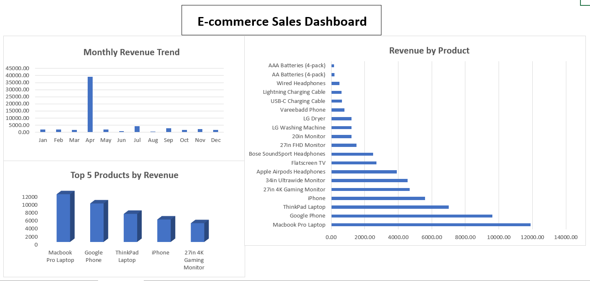

# E-commerce Sales Analysis Dashboard (Excel)

## 📌 Project Overview
This project focuses on analyzing e-commerce sales data using Microsoft Excel.
The objective is to clean raw sales data, calculate revenue, and build an interactive dashboard to identify revenue trends and top-performing products.

## 🛠 Tools & Skills Used
- Microsoft Excel
- Data Cleaning (blank rows, inconsistent dates)
- Excel Formulas (Revenue = Price × Quantity)
- Pivot Tables & Pivot Charts
- Dashboard Design & Layout
- GitHub Documentation (README)

## 📊 Key Analysis Performed
- Converted raw CSV data into an analysis-ready format
- Created a Revenue column using Price and Quantity
- Cleaned incomplete and blank records
- Analyzed month-wise revenue trends
- Identified Top 5 Products by Total Revenue
- Built a clean, professional Excel dashboard

## 📈 Dashboard Insights
- Clear visibility into monthly revenue performance
- Identification of top revenue-generating products
- Product-wise contribution to overall revenue

## 📸 Dashboard Screenshot

## 📂 Repository Contents
- `raw_data.csv` – Original dataset
- `Ecommerce_Sales_Dashboard.xlsx` – Cleaned data, analysis & dashboard
- `dashboard.png` – Dashboard preview image

## 🚀 Outcome
This project demonstrates practical Excel skills required for a Data Analyst role, including data cleaning, analytical thinking, pivot table analysis, and dashboard creation.
